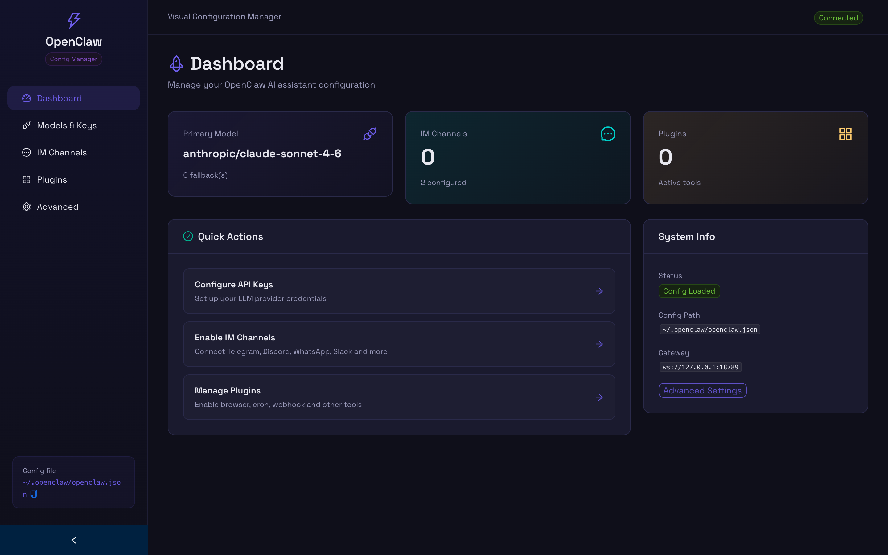
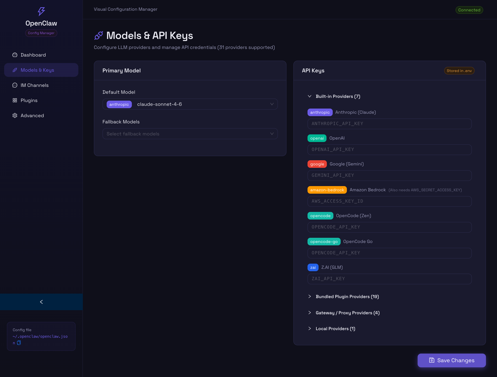
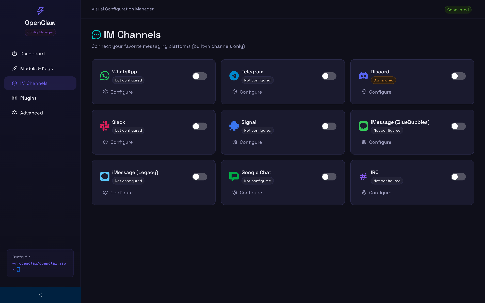
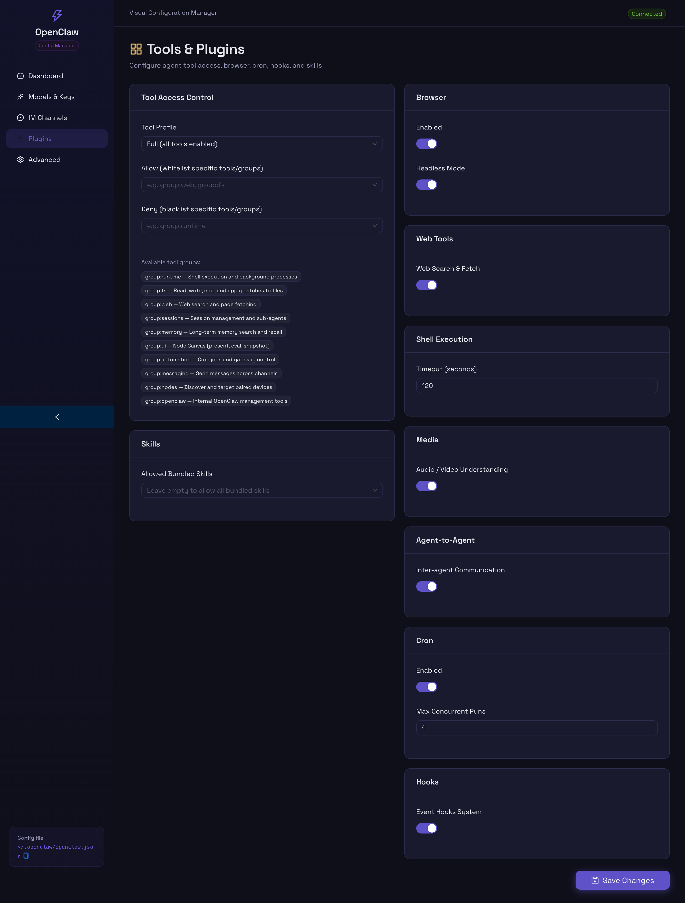
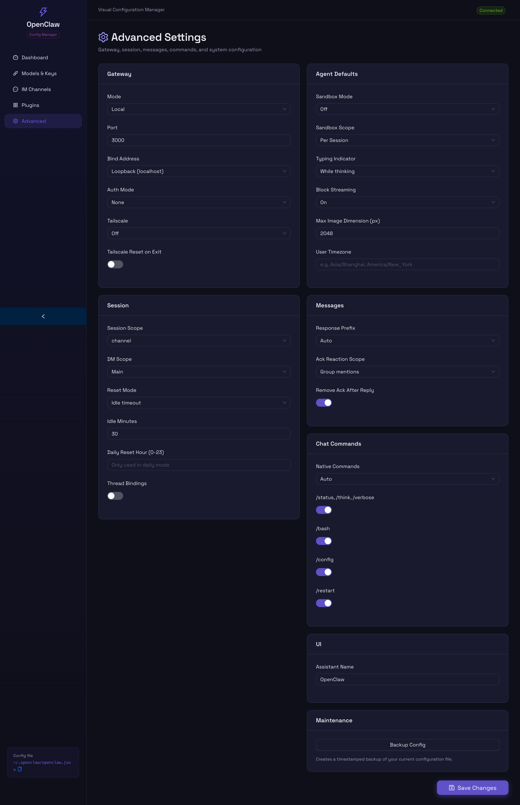

# OpenClaw Config

[](LICENSE)
[](https://nodejs.org/)
[](https://pnpm.io/)

A visual configuration manager for [OpenClaw](https://github.com/openclaw/openclaw) — the open-source, self-hosted AI assistant platform.

Manage your OpenClaw configuration through a modern web UI instead of manually editing JSON files.

## Screenshots

### Dashboard


### Models & API Keys


### IM Channels


### Tools & Plugins


### Advanced Settings


## Features

- **Dashboard** — Overview of your configuration status at a glance
- **Models & API Keys** — 31 LLM providers (Anthropic, OpenAI, Google, DeepSeek, Mistral, xAI, Groq, MiniMax, and more) with secure `.env` storage
- **IM Channels** — 9 built-in messaging platforms aligned with OpenClaw official docs
  - WhatsApp, Telegram, Discord, Slack, Signal, iMessage (BlueBubbles), iMessage (Legacy), Google Chat, IRC
- **Tools & Plugins** — Tool access control (profiles, allow/deny), browser, web, shell exec, media, cron, hooks, and skills
- **Advanced Settings** — Gateway, session, messages, chat commands, sandbox, Tailscale, UI, and agent defaults with one-click backup
- **Dark Theme** — Modern, polished dark UI built with Ant Design

## Quick Start

### Prerequisites

- [Node.js](https://nodejs.org/) 20+
- [pnpm](https://pnpm.io/) 10+

### Installation

```bash
# Clone the repo
git clone https://github.com/robertyang87/openclaw-config.git
cd openclaw-config

# Install dependencies
pnpm install

# Start development servers
pnpm dev
```

Open http://localhost:5173 in your browser.

### Available Scripts

| Command           | Description                        |
| ----------------- | ---------------------------------- |
| `pnpm dev`        | Start frontend + backend           |
| `pnpm dev:web`    | Start frontend only (port 5173)    |
| `pnpm dev:server` | Start backend only (port 3210)     |
| `pnpm build`      | Build all packages for production  |

## Architecture

```
openclaw-config/
├── packages/
│   ├── web/            # React frontend
│   │   └── src/
│   │       ├── api/          # API client functions
│   │       ├── components/   # Reusable UI components
│   │       ├── pages/        # Route pages
│   │       └── styles/       # Global CSS
│   └── server/         # Express backend
│       └── src/
│           ├── routes/       # REST API routes
│           └── utils/        # Config file read/write
├── package.json        # Root workspace config
└── pnpm-workspace.yaml
```

## Tech Stack

| Layer    | Technology                          |
| -------- | ----------------------------------- |
| Frontend | React 19, Vite 6, TypeScript        |
| UI       | Ant Design 5 (dark theme)           |
| Backend  | Express 5, TypeScript, tsx          |
| Icons    | react-icons (Simple Icons + Tabler) |
| Monorepo | pnpm workspace                      |

## API Reference

The backend serves a REST API for managing `~/.openclaw/openclaw.json`:

| Method  | Endpoint                | Description              |
| ------- | ----------------------- | ------------------------ |
| GET     | `/api/config`           | Read full configuration  |
| PUT     | `/api/config`           | Replace full config      |
| PATCH   | `/api/config/:section`  | Update a config section  |
| POST    | `/api/config/backup`    | Create timestamped backup|
| GET     | `/api/status`           | Health check             |

## Configuration

On first launch, the backend creates a default config at `~/.openclaw/openclaw.json` if one doesn't exist. Backups are stored in `~/.openclaw/backups/`.

## Contributing

Contributions are welcome! Please follow these steps:

1. Fork the repository
2. Create a feature branch (`git checkout -b feat/amazing-feature`)
3. Commit your changes (`git commit -m 'feat: add amazing feature'`)
4. Push to the branch (`git push origin feat/amazing-feature`)
5. Open a Pull Request

### Development Guidelines

- Follow [Conventional Commits](https://www.conventionalcommits.org/) for commit messages
- Use TypeScript strict mode
- Keep components small and focused

## Roadmap

- [ ] JSON editor with syntax highlighting for raw config editing
- [ ] Real-time connection status per channel
- [ ] Import/export config files
- [ ] Docker support
- [ ] i18n (English / Chinese)

## License

This project is licensed under the MIT License — see the [LICENSE](LICENSE) file for details.

## Acknowledgments

- [OpenClaw](https://github.com/openclaw/openclaw) — The AI assistant platform this tool configures
- [Ant Design](https://ant.design/) — UI component library
- [react-icons](https://react-icons.github.io/react-icons/) — Brand icons
